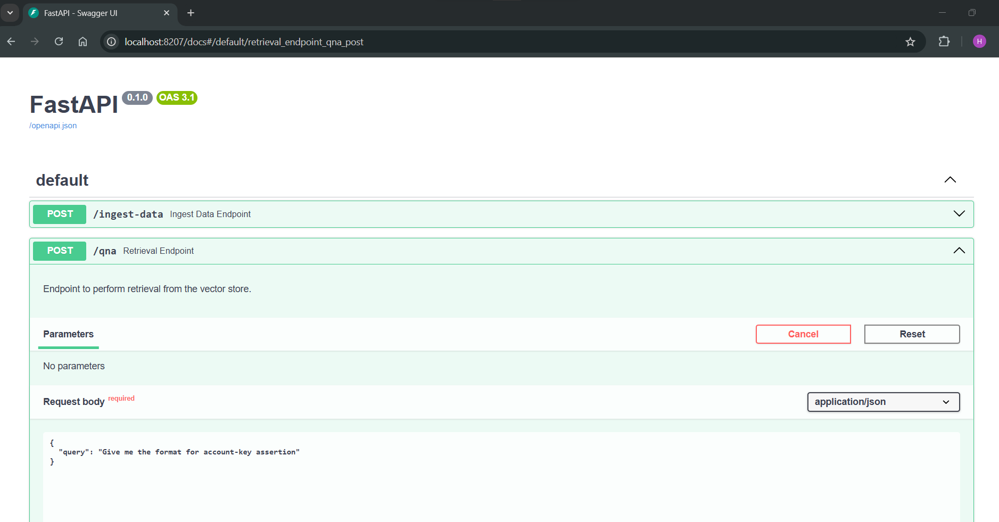
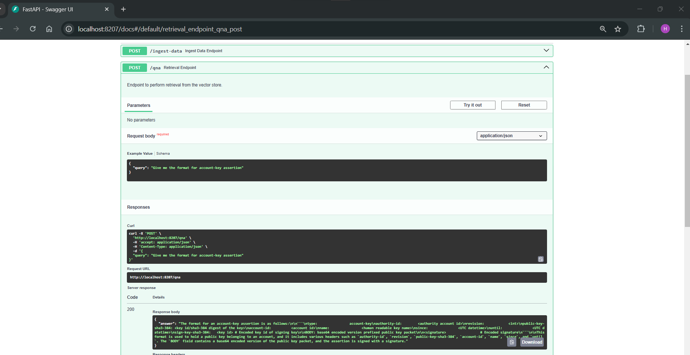
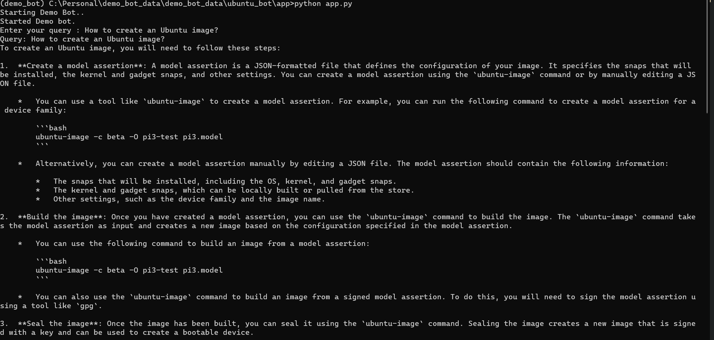
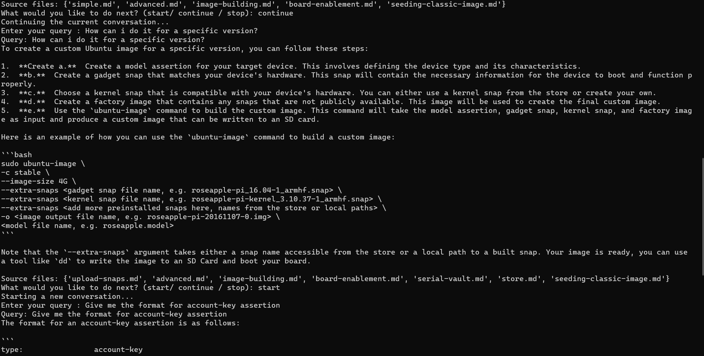
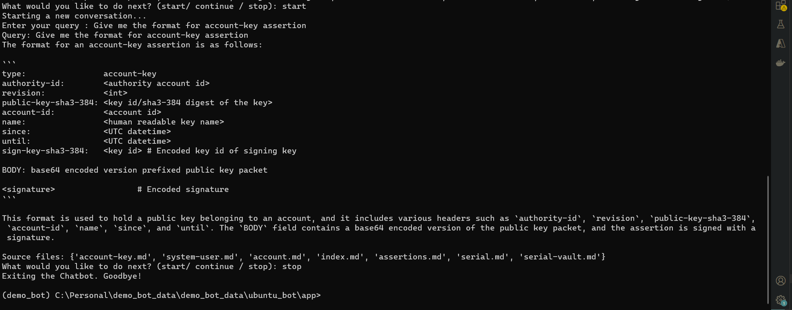

# 📁 Chatbot for File-Based QA

A chatbot system built to interact with and answer questions based on files provided by the user.

---

## 🚀 Task
- Creating a Q&A chatbot (Basic RAG) that utilizes a vector store and Language Model (LLM) to provide accurate responses to user queries. 
- To create a vector store from provided Ubuntu documentation in markdown format and integrate it with the chatbot system.
- Create Chatbot using Vector Store and LLM
- Create a FastAPI endpoint to locally deploy the application and run query

---

## 🧠 Approach
---

## 🏗️ Data Pipeline

### 📥 Ingestion
- Walk over all the folders and lookout for .md files 
- save these .md file paths for parsing
- Iterate over all files
- Utilize *markdown* library to convert these into texts

### ✂️ Chunking
- Used *MarkdownHeaderTextSplitter* from langchain for Chunking the Markdown Texts 
- This chunker splits on different markdown levels and mantains the hierarchy and text
- For each of the parsed files , chunk the texts based on the Markdown levels
- for all the chunks add the relevant Headings to them to maintain the context 
- Add File name in metadata
- This approach cleanly chunks the files according to structure of Headings and subheadings

### 🧠 Vector Storing and Indexing

- Utilized ChromaDB from Langchain as a vector database for storing dense chunk embeddings and its information
- Created CRUD operation class for the Vector store
- Initialize the path and the vector store name
- Used Hugging face embeddings for vectorizing, utilized - sentence-transformers/all-MiniLM-L6-v2 as embedding model
- Once chunking is done, add the texts and metadatas in the Chromadb Vector store by custom CRUD function.
- Do it for all files
- Persist the DB at the given path

---

## 🔮 Inference (QnA chatbot)

### 🤖 LLM
- Utilized Huggingface inference for LLM
- Model used - meta-llama/Llama-3.1-8B-Instruct
- Its a free tier, utilizing HuggingFace API key

### 🛠️ Pipeline Approach

### 📦 Retrieval
- Used ChromaDB vector store as index for retrieval with Top K as 10 

### 💬 Prompting
- Created custom prompt for instructed QnA 
- Stored in prompts.yaml

### 🧠 Memory
- Implemented custom logic to get the previous question and answer and provide it in system prompt if Conversation is continued which then helps in memory retention.

---

### FastAPI 
- Implemented API endpoint for Ingestion 
- Implemented API endpoint for QnA

## 🔧 Further Improvements

- Chunking can be improved by having more granular or advanced mechanisms like - Parent child , LLM based etc
- Better LLM can be used for inferencing
- Can include intermediatory steps for Query reformulation etc
- Can implement full agentic-rag 
- Can optimize othe small pieces of Pipeline

---

## 📸 Screenshots

